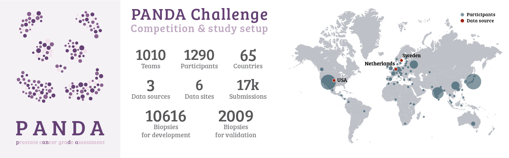

# The PANDA Challenge: Prostate cancer diagnosis using the Gleason grading system

Code related to analysis of algorithms sourced through the PANDA challenge.

- **Main website**: https://panda.grand-challenge.org/
- **Challenge platform**: https://www.kaggle.com/c/prostate-cancer-grade-assessment
- **Study design**: https://zenodo.org/record/3715938

**Organizers and main study contributors:** [Wouter Bulten](https://github.com/wouterbulten), [Kimmo Kartasalo](https://github.com/kimmokartasalo), [Po-Hsuan Cameron Chen](https://github.com/cameronphchen), Peter Ström, Hans Pinckaers, Kunal Nagpal, Yuannan Cai, David Steiner
Hester van Boven, Robert Vink, Christina Hulsbergen-van de Kaa, Jeroen van der Laak, Hemamali Samaratunga, Brett Delahunt, Toyonori Tsuzuki, Tomi Häkkinen, Henrik Grönberg, Lars Egevad, Maggie Demkin, Sohier Dane, Lily Peng, Craig Mermel
Pekka Ruusuvuori, Geert Litjens, Martin Eklund

## Getting started with the PANDA dataset

All images in the dataset are whole-slide images (WSI) and the notebook contains some starting points on using these types of images. To get you up to speed with the dataset of the competition, we have made a [getting started notebook](https://github.com/DIAGNijmegen/panda-challenge/blob/main/notebooks/getting-started-with-the-panda-dataset.ipynb). You can also view/run this notebook directly on the Kaggle platform. For the live version, please see the [Kaggle Getting Started notebook](https://www.kaggle.com/wouterbulten/getting-started-with-the-panda-dataset).

As a quickstart, the following 4-line snippet can be used to load a patch from one of the images:

```python
import openslide

# Open the image (does not yet read the image into memory)
image = openslide.OpenSlide('005e66f06bce9c2e49142536caf2f6ee.tiff')

# Read a specific region of the image starting at upper left coordinate (x=17800, y=19500) on level 0 and extracting a 256*256 pixel patch.
# At this point image data is read from the file and loaded into memory.
patch = image.read_region((17800,19500), 0, (256, 256))

# Display the image
display(patch)

# Close the opened slide after use
image.close()
```
Output:


## Computing metrics

To generate metrics for a team or a group of teams, the [`compute-metrics-all-teams.py`](src/compute-metrics-all-teams.py) script can be used. The script computes scores for all datasets and teams defined in the [config](src/evaluation/config.py).

This dataset contains somme dummy data for two fake teams in the `algorithms` directory. After running the script, the metrics of those teams will be outputted to the `results` directory.
## How to cite this work?

The PANDA dataset is currently under embargo, awaiting publication of the study results. Please see this Kaggle post for more information: https://www.kaggle.com/c/prostate-cancer-grade-assessment/discussion/201117

## License

This work is licensed under the Apache License 2.0.